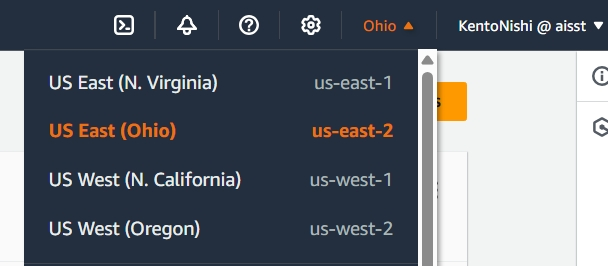
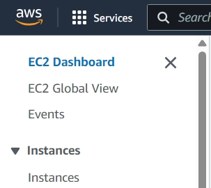
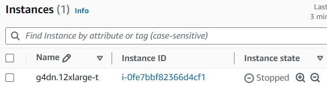
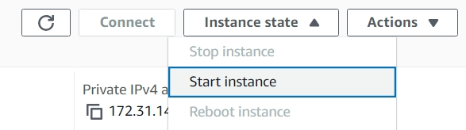
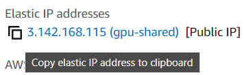

# AISST AWS Guide

*Last updated: Oct. 8, 2024*

This guide walks you through the process of requesting access to compute resources via the AISST AWS organization.

> **Note:** The AISST AWS organization is intended for research purposes only. We are currently only able to fund one [g4dn.12xlarge-t](https://instances.vantage.sh/aws/ec2/g4dn.12xlarge) instance shared among all users. Please be mindful of your resource usage.

## Request Access

Contact [@Kento Nishi](https://aisstworkspace.slack.com/team/U04PRJTUT9T) via the AISST Slack. In your message, include the following information:

- Your full name
- Your preferred AWS email address
- Your preferred AWS username
- Your preferred Unix username
- Your compute needs (i.e. CPUs, GPU VRAM, memory, storage)
- Details about your project and intended resource usage
- Your ssh public key (if you do not have one, generate one as below)

#### Generating an SSH Key (if you do not have one)

To generate an SSH key, run the following command in your terminal:

```bash
ssh-keygen -t ed25519 -C "your_email@example.com"
```

When prompted, press `Enter` to save the key in the default location (`~/.ssh/id_ed25519` on Unix systems, `C:\Users\your_username\.ssh\id_ed25519` on Windows systems). You do not need to enter a passphrase (just press `Enter` twice).

To get the public key, copy the contents of the file `~/.ssh/id_ed25519.pub` (or `C:\Users\your_username\.ssh\id_ed25519.pub` on Windows systems). Include this public key in your message to [@Kento Nishi](https://aisstworkspace.slack.com/team/U04PRJTUT9T).

## Join the AISST AWS Organization

Once you have been granted access, you will receive an account creation link (or an invitation email if you already have an existing AWS account) to join the AISST AWS organization. Follow the instructions to join the organization and access the AISST AWS Console.

## View EC2 Instances

Our EC2 instances are located in the `us-east-2` (Ohio) region. First, ensure that you are in the correct region by selecting `us-east-2` from the dropdown menu in the top right corner of the AWS Console.



To view the instances, navigate to the EC2 Dashboard in the AWS Console. Then, click on `Instances` in the left-hand menu.



## Connect to EC2 Instances

First, select the instance of interest in the list of instances (by clicking on the instance ID).



If the instance is in the `stopped` state, you will have to start the instance. To do this, click on the `Actions` dropdown menu and select `Instance state` > `Start instance`. If the instance is already running, you can skip this step.



Now, find the `Elastic IP addresses` of the instance in the instance summary view, and copy the address.



You can now connect to the instance via ssh using the copied Elastic IP address and your assigned Unix username. For example:

```bash
ssh kento@1.234.567.890
```

## Stopping EC2 Instances

By default, instances are set to automatically stop if the average CPU utilization is below 5% for 1 hour. **Please do not terminate instances manually, as other users may be using the same instance.**

## Help and Support

Feel free to reach out to [@Kento Nishi](https://aisstworkspace.slack.com/team/U04PRJTUT9T) via the AISST Slack for any questions or issues.
